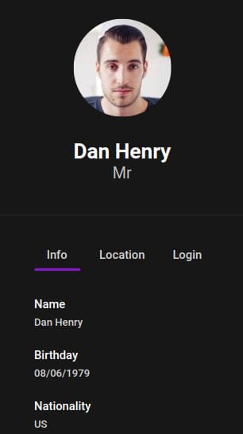
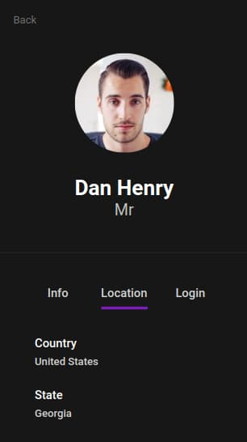

[Clique aqui e veja Online](https://github.com/drewdomi/)

## 💭 Oque é esse projeto?
Este é um aplicativo web desenvolvido em **React** com **TypeScript** que consome dados da API [RandomUser.me](https://randomuser.me/) para gerar uma tabela com informações de usuários. A aplicação utiliza o **React Router** para permitir a navegação entre diferentes páginas, e o **Axios** para fazer requisições HTTP à API.

## 🔥 Como instalar esse projeto?
- Primeiro baixe o repositório (seja por `git clone` ou através do arquivo .zip no botão "Code <>").
- Com o projeto já **baixado** e/ou descompactado entre na pasta e **rode o comando** `npm install` para baixar e instalar todas as dependencias!!
- Agora dê o comando `npm run dev` para iniciar o projeto.
- O projeto estará disponível para acesso apartir do link [http://localhost:5173/](http://localhost:5173/).

## 💡 Características principais:
- **Tabela de Usuários**: Exibe os dados dos usuários recebidos da API RandomUser.
- **Ver Perfil**: Clique no link "Ver Perfil" e veja mais informações sobre o usuário selecionado.
- **Validação de Usuário**: Valida se o usuário existe ou não.

## 🖥️ Tecnologias Utilizadas:
- **React**: uma biblioteca JavaScript popular usada para criar interfaces de usuário, permitindo renderização eficiente e atualizações contínuas.
- **TypeScript**: Um supersest JavaScript que adiciona recursos de tipagem estática e outros recursos avançados para melhorar a produtividade e a qualidade do código. Ele nos ajuda a evitar erros comuns e oferece um ambiente de desenvolvimento mais robusto.
- **React Router**: Uma poderosa biblioteca de roteamento para React que facilita a navegação e o gerenciamento de URL dentro do aplicativo.
- **Axios**: Uma biblioteca JavaScript popular usada para fazer solicitações HTTP a servidores e APIs. Ela fornece uma interface simples para enviar e receber dados, lidando com promises e oferecendo suporte a várias funcionalidades, como interceptadores e cancelamento de solicitações.
- **React Query**: Uma poderosa biblioteca JavaScript projetada para aprimorar a gestão de estado de dados e a interação com APIs e recursos de back-end em aplicações React de maneira altamente otimizada e eficaz.
- **SCSS** (Sass): Um pré-processador css que estende a sintaxe do CSS convencional oferecendo recursos avançados, como variáveis, aninhamento, mixins e importação, facilitando a escrita e a manutenção de estilos complexos em projetos web.

## ✅ Todos
- [x] Criar Rotas
- [x] Listar usuários
- [x] Pesquisar usuários 
- [x] Paginar 10 usuários por página
- [x] Visualizar o perfil de um usuário especifico
- [x] Responsividade
- [x] Storybook
